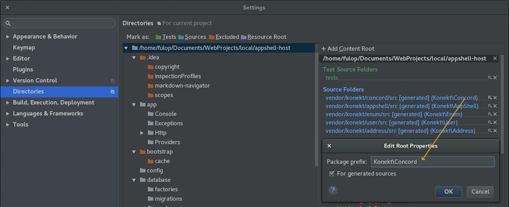
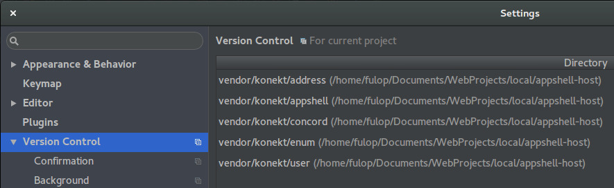

# Konekt AppShell

Konekt AppShell is a [Concord box](https://github.com/artkonekt/concord/blob/master/docs/boxes.md) (thus a Laravel Extension) that serves as a foundation for Laravel business applications.

Incorporates the basics for:

- Users and their profiles
- Authentication
- Clients
- Impersonation
- Extensible Admin Interface

The user/auth part is built on top of the Laravel facilities in a compatible manner.

## Create New AppShell Project (for contributing to appshell, concord, etc)

```bash
composer create-project laravel/laravel ashtest
# Wait 1-4 minutes to complete ...
cd ashtest
composer config minimum-stability dev
composer require --prefer-source konekt/appshell:dev-master
touch config/concord.php
```

Edit `config/concord.php` and add this content to it:

```php
<?php

return [
    'modules' => [
        Konekt\AppShell\Providers\ModuleServiceProvider::class
    ]
];
```

Edit `config/app.php` and add this line to the `providers` array (below 'Package Service Providers', always above 'Application Service Providers')

(_Below tinker, as of v5.4_)

```php
Konekt\Concord\ConcordServiceProvider::class,
```

Test if it works by invoking the command

```bash
php artisan concord:list
```

Now you should see this:

```
+----+---------------------+------+---------+------------------+-----------------+
| #  | Name                | Kind | Version | Id               | Namespace       |
+----+---------------------+------+---------+------------------+-----------------+
| 1. | Konekt AppShell Box | Box  | 0.1.0   | konekt.app_shell | Konekt\AppShell |
+----+---------------------+------+---------+------------------+-----------------+
```

After configuring `.env`, run the migrations:

```bash
php artisan migrate
```

AppShell contains ~10-15 migrations out of the box


### Configure PhpStorm For Properly Editing Sources In Vendor

You can set up PhpStorm to directly edit the source files in vendor, and have full IDE support.

#### Source Folders
First mark these folders as source folders, in PhpStorm's **Settings->Directories**.



Also add their namespace prefixes by clicking that small 'p' with the caret, and ticking [] for generated sources. Refer the Package prefix (namespace) on the screenshot above.

#### Git, Our Friend

Go to PhpStorm->**Settings->Version Control** and add the package folders you want to modify locally and push back to the repo:




## Built-in Facilities

### Menu

The menu functionality is built on top of [Lavary Menu Component](https://github.com/lavary/laravel-menu). The component is automatically loaded, is fully available (incl. the `Menu` facade).

AppShell creates a menu named **appshellMenu** which is the main menu component, and is available in views as `$appshellMenu`.

