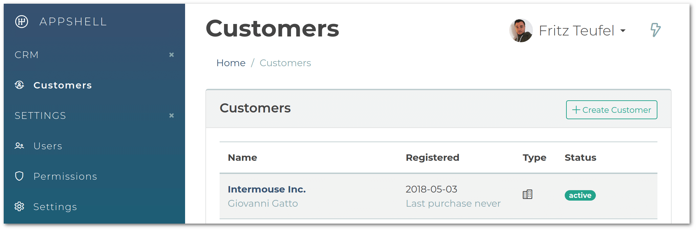

# Konekt AppShell

Konekt AppShell is a Laravel Extension that serves as foundation for Laravel business applications.

- Users, profiles, invitations
- ACL: permissions & roles
- An extensible admin panel
- Admin UI can be completely replaced (via adding a Theme)
- Icon themes
- Customers
- Addresses, countries, provinces
- Breadcrumbs
- User manageable settings (applies to entire app)
- User preferences (applies to user)

The user/auth part is built on top of the Laravel facilities in a compatible manner.

AppShell is built on top of [Concord](https://konekt.dev/concord/1.8/overview)
so this package is also a [Concord box](https://konekt.dev/concord/1.8/boxes).

Refer to the [Documentation](https://konekt.dev/appshell/docs) for more details.

## Glimpse At The Default UI

