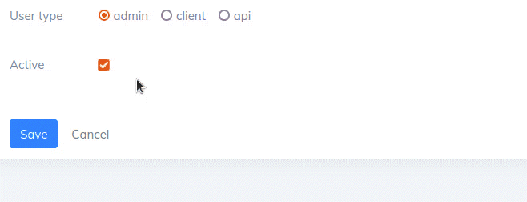

# AppShell Configuration

AppShell ships with a series of configuration options to improve the interoperability with your
application and to enable customization.

The easiest way to set configuration values is to pass them directly in `config/concord.php`:

```php
return [
    'modules' => [
        Konekt\AppShell\Providers\ModuleServiceProvider::class => [
            'breadcrumbs' => false, // to disable breadcrumbs feature            
        ]
    ]
];
```

## Associate The User with Customer Configuration

> This feature was added in v2.8

It is possible to assign users to customers on the user edit form.
This feature is **disabled by default**.

To enable this feature, you need to change `konekt.app_shell.ui.customer_selection_for_users`
configuration value. It can be set to:

- `true`: in this case, it is possible to assign a customer to any [type of user](https://konekt.dev/user/2.x/user-types).
- `array`: set the user types to allow customer selection for.

**Example**

```php
return [
    'modules' => [
        Konekt\AppShell\Providers\ModuleServiceProvider::class => [
            'ui' => [
                'customer_selection_for_users' => ['client', 'api'], // Enable for `client` and `api` types of users
            ],
        ]
    ]
];
```



## Disable Parts

You can disable the following features, by setting their respective keys to `true`:

| Feature         | Config Key                                | Effect                                                                                                             |
|:----------------|:------------------------------------------|:-------------------------------------------------------------------------------------------------------------------|
| Commands        | `konekt.appshell.disable.commands`        | The AppShell console commands wont be registered with Artisan                                                      |
| Login Counter   | `konekt.appshell.disable.login_counter`   | The `login_count` and `last_login_at` fields of the user won't be updated on login                                 |
| Paginator Style | `konekt.appshell.disable.paginator_style` | The [Laravel Paginator style](https://laravel.com/docs/9.x/pagination#using-bootstrap) won't be set to Bootstrap 4 |

## Auth Route Names

AppShell's default theme comes with default views for login, reset password and registration.
These views are the themed versions of the same views in default Laravel installation.

These views rely on a few named routes. These routes typically exist in most Laravel
applications. They are generated by Laravel's auth scaffolding, but these routes may or may not
be present in your application.

Additionally, this functionality (`Auth::routes()`, `artisan make:auth`) was deprecated with Laravel
6 and has been removed from Laravel 7 and moved to the `laravel/ui` composer package.

To change the **names** of these routes, configure these values:

```php
// config/concord.php
return [
    'modules' => [
        Konekt\AppShell\Providers\ModuleServiceProvider::class => [
            'ui' => [
                'routes' => [
                    'login'            => 'login_route', // The `login_route` must be defined with Route::get(...)
                    'logout'           => 'app.custom.logout_route',
                    'register'         => 'app.custom.register_route',
                    'password.request' => 'app.custom.password_request_route',
                    'password.email'   => 'app.custom.password_email_route',
                ]
            ]
        ]
    ]
]; 
```

The routes are used in the following views:

| Route Name           | HTTP Method | Description                        | Used By                                   |
|:---------------------|:------------|:-----------------------------------|:------------------------------------------|
| **login**            | `GET`       | The app's login URL                | - login.blade.php<br>- register.blade.php |
| **logout**           | `POST`      | The app's logout URL               | - _header.blade.php                       |
| **password.request** | `GET`       | Displays the password reset page   | - login.blade.php                         |
| **password.email**   | `GET`       | Sends the password reset link      | - email.blade.php                         |
| **password.request** | `POST`      | Submits the password reset request | - reset.blade.php                         |


---

**Next**: [Admin Panel &raquo;](admin-panel.md)
