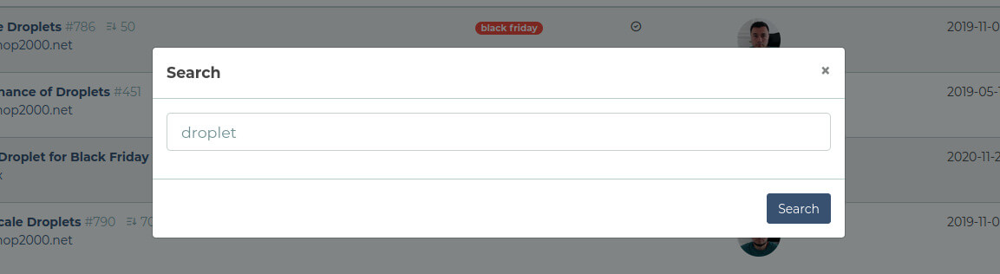

# Search Functionality

> Added in v2.4

AppShell has a generic search UI functionality.

It doesn't handle the backend of the search, it is left to the Application to be implemented.

AppShell offers:

- **Search UI**,
- Configuration of the **Search route**,
- **Enable/disable** search.

## The Search UI

The default Theme implements the Search UI as an icon button in the top right bar.


Clicking the Search icon opens a Modal with a search field and a search button.



The default AppShell theme defines a shortcut for the search: "doubleshift".
It means that pressing the SHIFT button twice in a rapid consecutive sequence opens the search modal.

Custom themes can implement the search arbitrarily, ie. there's no UI constraint at all.

## The Search Route

The built-in search feature relies on the search route defined by the application.
This can be done via setting a value for the `konekt.app_shell.ui.routes.search` configuration key.

This needs to be done in `config/concord.php`:

```php
return [
    'modules' => [
        Konekt\AppShell\Providers\ModuleServiceProvider::class => [
            'ui' => [
                'routes' => [
                    'login' => 'login',
                    'logout' => 'logout',
                    'register' => 'register',
                    'password.request' => 'password.request',
                    'password.email' => 'password.email',
                    'search' => 'your.search.route.name',
                ]
            ]
        ],
    ]
];
```

Mind that you also need to pass the login, logout, [...] routes as well along. This is due to the way Laravel handles
deep array configuration sets. 

> The route can be either POST or GET, the default search modal detects the method automatically.

The search field has the name "q" thus if you implement the search, you can obtain the search term using
`$request->get('q')` in your controller.

### Search Implementation Example

**routes/web.php**:

```php
//...
Route::get('/search', 'SearchController@handle')->name('search');
//...
```

> 💡 The Example below uses the [Cross-Eloquent Search Package](https://laravel-news.com/laravel-cross-eloquent-search) to fetch values from multiple models.

**SearchController.php**:

```php
use ProtoneMedia\LaravelCrossEloquentSearch\Search;

class SearchController extends Controller
{
    public function handle(Request $request)
    {
        $results = Search::new()
                     ->add(Post::class, 'title')
                     ->add(Video::class, 'title')
                     ->get($request->get('q'));

        return view('search.result', [
            'results' => $results,
            'query' => $request->get('q'),
        ]);
    }
}
```

## Enable or Disable Search

The search is disabled by default, since the `konekt.app_shell.ui.routes.search` config value is `null` by default.
Setting a route for this config key enables the search feature and enables it in the UI.

To check in blade views whether the search feature is enabled use the `$appshell->isSearchEnabled()` call:

```blade
@if($appshell->isSearchEnabled())
    <form action="{{ }}">
        <h2>Hey, I am your search</h2>
        <input name="q" type="text" placeholder="Enter search text here" />
        <button type="submit">Search</button>
    </form>
@endif
```

---

**Next**: [Customizing The Admin UI &raquo;](customize-admin-ui.md)
